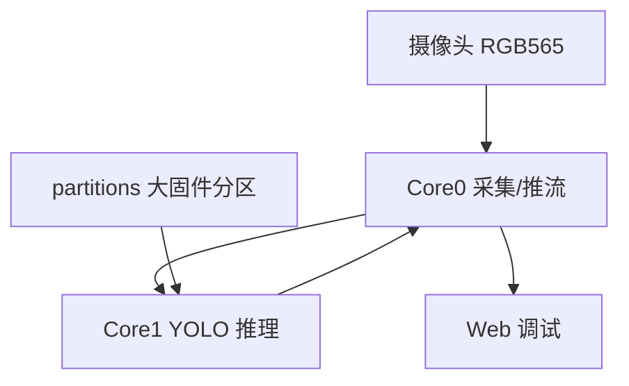

# Esp32s3_Vision_Yolo

「随身智护」ESP32-S3 视觉分支：在双核异步图传架构上强化 YOLO/人脸检测与分区配置（大 factory 分区容纳模型）。

## 系统架构图

```mermaid
flowchart TB
  CAM[摄像头 RGB565] --> C0[Core0 采集/推流]
  C0 --> C1[Core1 YOLO 推理]
  C1 --> C0
  C0 --> WEB[Web 调试]
  PART[partitions 大固件分区] --> C1
```

## 功能框图

```mermaid
flowchart LR
  WIFI[联网] --> VID[视频服务]
  VID --> MODEL[YOLO 模型]
  MODEL --> DET[检测结果]
  DET --> UI[叠框/告警扩展]
```

## 远程

origin → https://github.com/linxi27667/Esp32s3_Vision_Yolo.git
